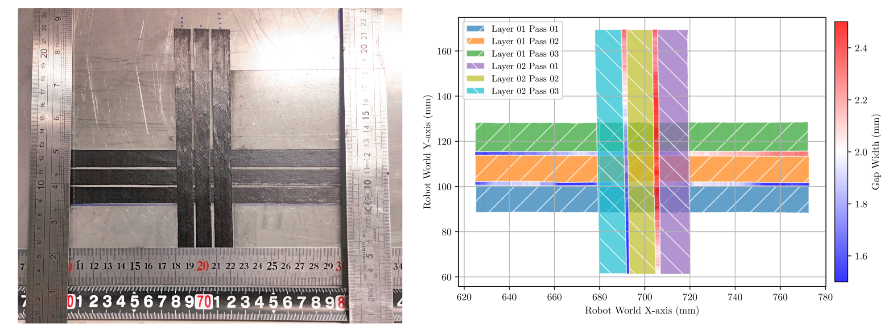
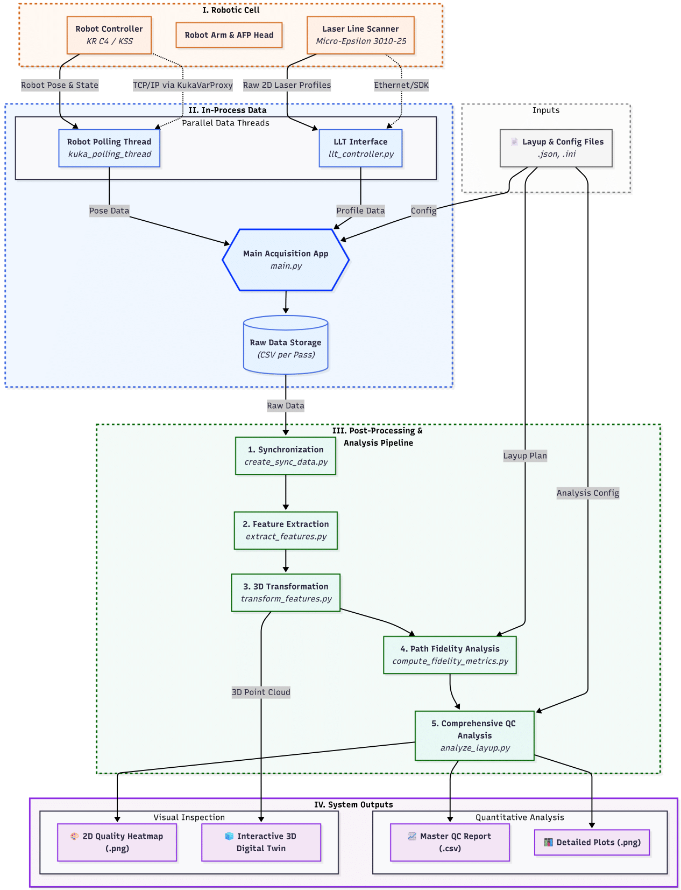

# In-Process Inspection Framework for Automated Fiber Placement


This repository contains the official Python source code and data for the research paper:

> **An Open-Source Framework for In-Process Geometric Quality Assurance in Automated Fiber Placement: A Baseline Validation and Dataset**  
> *Diogo Cardoso, António Ramos Silva, Nuno Correia*  
> Journal Name, 2025.
> **[Read the Full Paper Here]**

## Dataset Archive
The raw dataset corresponding to the baseline validation in our paper is permanently archived on Zenodo and can be cited using the following DOI:
https://doi.org/10.5281/zenodo.17048469

---

## 🎯 Project Goal

This project provides a complete, modular pipeline for the in-process acquisition, processing and analysis of manufacturing data from an Automated Fiber Placement (AFP) system. The framework uses a laser line scanner and real-time robot pose data to generate a metrologically accurate "as-built" geometric digital twin of the composite layup, enabling a shift from post-process inspection to in-process verification.

<p align="center">
  
</p>
<p align="center">
  <em><b>Figure 1:</b> Validation of the framework's output. (Left) The physical [0/90] layup. (Right) The corresponding digitally generated reconstruction, showing a direct match in world coordinates.</em>
</p>

---

## 🧱 System Architecture

The framework is built on a model-driven architecture that decouples the high-level manufacturing plan from the low-level data acquisition and processing logic. A central, multi-threaded Python application orchestrates data collection from the KUKA robot controller and the Micro-Epsilon laser scanner.

<p align="center">
  
</p>
<p align="center">
  <em><b>Figure 2:</b> The four primary domains of the system architecture, from the physical Robotic Cell to the final System Outputs.</em>
</p>

---

## 🛠️ Installation

This project requires Python 3.9+ and several third-party libraries.

1.  **Clone the repository:**
    ```bash
    git clone https://github.com/f4y2021/afp-in-process-inspection.git
    cd afp-in-process-inspection
    ```

2.  **Create a virtual environment (recommended):**
    ```bash
    python -m venv venv
    source venv/bin/activate  # On Windows, use `venv\Scripts\activate`
    ```

3.  **Install the required packages:**
    <!-- **ACTION:** You need to generate this file from your environment using: pip freeze > requirements.txt -->
    ```bash
    pip install -r requirements.txt
    ```

---

## 🚀 Pipeline Workflow & Usage

The analysis is performed by executing the Python scripts sequentially. The workflow is divided into two main stages: the **Core Analysis Pipeline**, which generates the primary 2D reconstruction and QC report, and the **Advanced Analysis & Visualization** steps for deeper diagnostic insights.

### Core Analysis Pipeline

This is the main workflow for processing the raw data into a final quantitative summary.

| Step | Script | Description |
|:---:|---|---|
| 0️⃣ | `main.py` | **Live Acquisition:** Connects to hardware and records raw sensor and robot data based on the `layup_plan.json`. |
| 1️⃣ | `create_sync_data.py` | **Synchronization:** Merges raw robot poses and laser profiles using timestamps. |
| 2️⃣ | `extract_features.py` | **Feature Extraction:** Detects tow and gap edges from each laser profile using a state-aware heuristic. |
| 3️⃣ | `transform_features.py` | **3D Transformation:** Converts 2D sensor features into 3D world coordinates using the hand-eye calibration. |
| 4️⃣ | `analyze_layup.py` | **Analysis & Reporting:** Computes inter-tow QC metrics (gap, step, etc.) and generates the final 2D reconstruction plot and QC report. |

**To run the full core post-processing pipeline:**
```bash
# Processes raw data from a completed acquisition (Step 0)
python create_sync_data.py
python extract_features.py
python transform_features.py
python analyze_layup.py
```

---

### Advanced Analysis & Visualization

These scripts provide insights into path fidelity and allow for interactive 3D inspection. They should be run after the core pipeline is complete.

| Step | Script | Description |
|:---:|---|---|
| 5️⃣ | `compute_fidelity_metrics.py` | **Path Fidelity Analysis:** Calculates metrics like Lateral Path Deviation (LPD) to assess the robot's dynamic placement accuracy. |
| 6️⃣ | `create_structured_surface.py` | **Surface Generation:** Processes the synchronized scan data into a structured point cloud (`.ply` file) suitable for 3D viewing. |
| 7️⃣ | `inspect_structured_surface.py` | **Interactive Visualization:** Launches an advanced GUI tool for detailed 3D inspection of the generated surface, including virtual slicing. |

**To run the advanced analysis steps:**
```bash
# (Run this after the core pipeline is complete)
# To calculate path fidelity metrics:
python compute_fidelity_metrics.py

# To generate and then inspect the 3D surface:
python create_structured_surface.py
python inspect_structured_surface.py
```
---

## 📂 Data & Folder Structure

The project expects a specific hierarchical folder structure for data management. All raw and processed data for a given manufacturing session is stored in a timestamped directory.

```
/
├── config/                  # Configuration files (hardware, layup plan)
├── data/                    # Root folder for all layup sessions
│   └── PART-001-DEMO_.../   # Data for a single session
│       ├── Layer_01/
│       │   └── Pass_01/     # Data for a single pass
│       │       ├── robot_path_data_...csv            (RAW INPUT)
│       │       ├── laser_scan_x_coordinates_...csv   (RAW INPUT)
│       │       ├── laser_scan_z_profiles_...csv      (RAW INPUT)
│       │       ├── synchronized_scan_...csv          (OUTPUT of Step 1)
│       │       ├── laser_tow_gap_features_...csv     (OUTPUT of Step 2)
│       │       └── transformed_laser_results_...csv  (OUTPUT of Step 3)
│       └── final_comparison_results_...csv           (OUTPUT of Step 4)
│       └── layup_reconstruction_all_layers.png       (OUTPUT of Step 4)
├── src/                     # Source code for hardware control & processing logic
├── main.py                  # ... and other top-level scripts
└── requirements.txt         # Project dependencies```

```

## 🎓 Citing This Work

If you use this code or methodology in your research, please cite the paper.

<!-- [ACTION]: Get the official BibTeX from your publisher's website once available. -->
```bibtex
@article{Cardoso2025,
  title={An Open-Source Framework for In-Process Geometric Quality Assurance in Automated Fiber Placement: A Baseline Validation and Dataset},
  author={Cardoso, Diogo and Silva, Ant{\'o}nio Ramos and Correia, Nuno},
  journal={Journal Name},
  year={2025},
  publisher={Publisher}
}
```

---

## 📜 License

This project is licensed under the MIT License. See the [LICENSE](LICENSE.txt) file for details.
